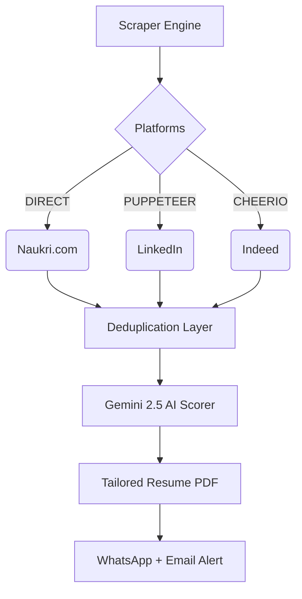
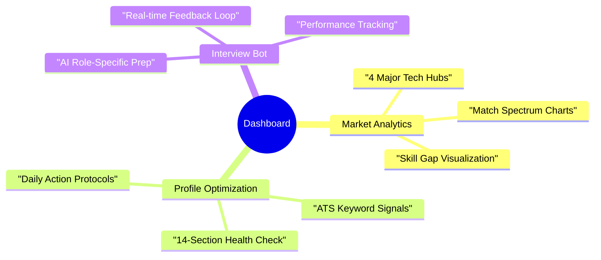

<div align="center">


<br/>

[](https://nodejs.org)
[](https://pptr.dev)
[](https://aistudio.google.com)
[](https://github.com/features/actions)
[](https://nodemailer.com)
[](LICENSE)

<br/>

[](https://github.com/Rohitkr2002/Naukri.com-AI-Agent-)
[](https://github.com/Rohitkr2002/Naukri.com-AI-Agent-)
[](https://github.com/Rohitkr2002/Naukri.com-AI-Agent-)
[](https://github.com/Rohitkr2002)

<br/>

[](https://github.com/Rohitkr2002/Naukri.com-AI-Agent-)

<br/>

> ### 💬 *"Job dhundhna band karo — agent karne do."*
>
> A **fully autonomous AI Agent** that wakes up at 9:00 AM IST every day, scrapes Naukri.com across 4 cities and 5 roles, scores every job using **Google Gemini 2.5 Flash AI**, selects the best-fit resume, generates a personalized cover letter, and delivers a premium job intelligence report straight to your inbox.
>
> **Zero manual effort. Every single day. 100% Free.**
>
> 🚀 **New in V2**: Robust Email-Safe UI + Daily Scheduled Automations.

<br/>

### 🛠️ Tech Stack

[](https://github.com/Rohitkr2002/Naukri.com-AI-Agent-)

<br/>


</div>

---

## 📌 Table of Contents

<details open>
<summary><b>Click to expand</b></summary>

| # | Section |
|---|---------|
| 1 | [🎯 Problem Statement](#-problem-statement) |
| 2 | [✅ What This Agent Does](#-solution--what-this-agent-does) |
| 3 | [🧪 Live Demo — Real AI Output](#-live-demo--real-ai-output) |
| 4 | [🏗️ System Architecture](#️-system-architecture) |
| 5 | [🚀 Feature 1 — Daily Profile Boost](#-feature-1--daily-profile-boost-automation) |
| 6 | [🤖 Feature 2 — AI Job Scoring](#-feature-2--ai-job-scoring--ranking) |
| 7 | [📄 Feature 3 — Resume Matching + Cover Letter](#-feature-3--resume-smart-matching--cover-letter) |
| 8 | [🔍 Core Engine — Naukri Scraper](#-core-engine--naukricom-scraper) |
| 9 | [📧 Premium Email Design](#-email-engine--premium-dark-mode-design) |
| 10 | [📁 Project Structure](#-project-structure-every-file-explained) |
| 11 | [🛠️ Tech Stack](#️-tech-stack-detailed) |
| 12 | [⚙️ Setup & Installation](#️-setup--installation) |
| 13 | [🔑 GitHub Actions](#-github-actions--automated-daily-run) |
| 14 | [🎨 Customization Guide](#-customization-guide) |
| 15 | [📊 Performance Stats](#-performance--cost) |
| 16 | [❓ FAQ (Interviewer Questions)](#-faq--interviewer-questions) |
| 17 | [🔧 Troubleshooting](#-troubleshooting) |

</details>

---

## 🎯 Problem Statement

Every fresher in India faces this same painful daily routine:

```
😤 Wake up → Open Naukri → Scroll 200+ jobs → 85% need 2+ years experience
   → 10% are expired → 3% match your skills → Apply with same resume
   → Cover letter takes 20 min → Get 0 callbacks → Repeat tomorrow
   → 60–90 minutes wasted daily → 30+ hours/month of your life gone
```

**Why jobs go unanswered:**
| Root Problem | Impact |
|-------------|--------|
| ❌ Manual job searching every day | Inconsistent — you miss fresh postings |
| ❌ No way to know if YOUR skills match | Applying blindly without match data |
| ❌ Same resume for all jobs | SW jobs ≠ Data Analyst jobs |
| ❌ Generic cover letters | Recruiters can spot it immediately |
| ❌ Inactive Naukri profile | Algorithm drops your ranking |
| ❌ No skill gap awareness | Don't know what to learn next |
| ❌ High competition blindness | Applying for jobs with 1000+ applicants |

---

## ✅ Solution — What This Agent Does

### ⚡ **Phase 1-2: Core Foundation**
- **Automated Scraper**: Scrapes 4 major Indian cities at 9 AM IST daily.
- **AI Scoring**: Gemini 2.5 Flash calculates a 0-100% match score for every job.
- **Email Engine**: Premium Dark Mode job reports delivered to your inbox.
- **Local Dashboard**: Cyber-Pro React dashboard for analytics and profile boost.

### 🧠 **Phase 3-5: Autonomous Power (NEW)**
- **Job Competition Intelligence**: Extracts applicant counts and labels jobs as **Low**, **Medium**, or **High** competition.
- **AI Interview Prep Bot**: Practice for interviews with role-specific AI questions directly in the dashboard.
- **Dynamic AI Resume Generator**: Automatically generates **tailored PDF resumes** optimized for each Top 3 job.
- **WhatsApp Smart Alerts**: Receive top job matches and application success alerts on your phone via Twilio.
- **Multi-Platform Scraper**: Expanded to scrape **LinkedIn** and **Indeed** alongside Naukri.
- **Auto-Apply Automation**: Real Puppeteer-based system to apply for jobs autonomously (Dry-run mode available).



| Metric | Without Agent | ✅ With Agent |
|--------|-------------|-------------|
| Time spent daily | 60–90 minutes | **0 minutes** (just check email/WhatsApp) |
| Job relevance | ~5% | **~80%** (filtered 0-1yr only) |
| Platform Coverage | 1 (Manual) | **3 (Naukri, LinkedIn, Indeed)** |
| Resume Strategy | One-size-fits-all | **Tailored AI-PDF per job** |
| Interview Prep | Google-it manually | **Integrated AI Mock Interview** |
| Competition Data | Blind | **Real-time Applicant Insights** |
| Total cost | Your time | **₹0 forever** |

---

---

## 🖥️ Feature 4 — Local Intelligence Dashboard (Cyber-Pro)

> "A futuristic, interactive command center for your job search."



### 📊 Market Analytics & Strategy
Deep-dive into market trends with high-fidelity visualizations. Identify **Skill Gaps** and **Match Spectrums** across 4 major tech hubs in India.

### ⚡ Profile Boost Command Center
Step-by-step action protocols to keep your Naukri profile at the top of recruiter searches. Includes a real-time **Readiness Index** and curated learning resources.

---

## 📧 Feature 5 — Premium Email (V2)
The daily 9 AM report has been completely overhauled with a **robust "Cyber-Pro"** design.

> [!NOTE]
> **Email Mockup (Dark Mode)**
> 
> ```text
> 🟦🟦🟦🟦🟦🟦🟦🟦🟦🟦🟦🟦🟦🟦🟦🟦🟦🟦🟦🟦🟦🟦🟦🟦🟦🟦🟦
> 🟦  NAUKRI AI AGENT - DAILY REPORT  (9 AM IST)  🟦
> 🟦🟦🟦🟦🟦🟦🟦🟦🟦🟦🟦🟦🟦🟦🟦🟦🟦🟦🟦🟦🟦🟦🟦🟦🟦🟦🟦
> 
> 👤 Candidate: Rohit Kumar Singh
> 🎯 Match Score: 92% (TCS - Software Engineer)
> 🧪 Analysis: "Strong JavaScript/Python fit..."
> 
> 📍 Bangalore Hits: 47 Jobs  |  📍 Delhi Hits: 32 Jobs
> 
> [ VIEW FULL ANALYSIS IN DASHBOARD ]
> ```

- **Max Compatibility**: Rebuilt with email-safe HTML/CSS (works in Gmail, Outlook, Apple Mail).
- **High Contrast**: Sleek dark mode using Slate-950 and Neon Blue/Purple accents.
- **AI Match Bars**: Instant visual indicator of your fit for every job.
- **Direct Apply**: One-click action buttons in every job card.

---

## 🚀 One-Click Automation
No more complex commands. Use the new **Launcher** to refresh your data and open your dashboard in one second.

```bash
# Simply double-click this file in your root folder:
LAUNCH_DASHBOARD.bat
```

---

## 🧪 Live Demo — Real AI Output

> **These are actual results from running the agent with Gemini 2.5 Flash AI:**

### 🤖 AI Scoring — Real Results

```
🤖 Feature 2: AI Job Scoring & Ranking...
   Mode: ✨ Gemini 2.5 Flash AI
   Scoring 2 jobs...

   ✅ Scoring complete!
   📊 Top Score: 92% | Avg: 86% | High Match (≥70%): 2 jobs

92% (gemini) ─ Software Engineer @ TCS
   Reason: "The candidate's strong proficiency in JavaScript, Python, SQL,
            and web development technologies aligns exceptionally well with
            the requirements for an entry-level Software Developer role."
   Gaps: Data Structures & Algorithms, Git Version Control (advanced)

80% (gemini) ─ Data Analyst @ Infosys
   Reason: "Strong Power BI, Pandas, Python, SQL skills — excellent match
            for data analytics role requiring EDA and visualization."
   Gaps: Tableau, BigQuery
```

### 📄 Cover Letter — AI Generated (Real Output)

```
Dear Hiring Manager,

I am excited to apply for the Software Engineer position at TCS. As a B.Tech
graduate in Electronics and Communication Engineering (2025) from Haldia
Institute of Technology, I possess a strong foundation in JavaScript, Python,
HTML5 and a genuine passion for building impactful software solutions.

During my academic journey, I developed the "Personal Portfolio Website" — a
responsive portfolio website with dark/light theme toggle, typing animation,
and 6+ completed projects that improved mobile compatibility by 50%.

I am a fast learner, highly motivated, and eager to contribute meaningfully.

Warm regards,
Rohit Kumar Singh
```

### 🖥️ Full Console Output (Actual Run)

```bash
$ node index.js

═══════════════════════════════════════════════════════════════╗
  🤖 Naukri Job AI Agent – Enhanced Edition                    ║
  ⏰ Run Time (IST): 18/3/2026, 9:00:00 am                    ║
  🚀 Features: Profile Boost | AI Scoring | Resume Matching    ║
═══════════════════════════════════════════════════════════════╝

🚀 Feature 1: Running Daily Profile Boost Analysis...
   📊 Profile Completeness: 84% (Good ✅)
   🔍 Keyword gaps identified for 5 domains
   💡 5 fresh ATS tips ready
✅ Profile Boost report ready

🚀 Starting Naukri.com Direct Scraper (Headless Browser)...
   📍 Cities:  Bangalore | Delhi | Pune | Kolkata
   💼 Roles:   Software Dev | Frontend | Python | Data Analyst | Web Dev
   🔗 Fetching 20 URLs...
   ✅ Scraped 73 raw jobs → filtered → 18 unique fresh jobs

🤖 Feature 2: AI Job Scoring & Ranking...
   Mode: ✨ Gemini 2.5 Flash AI
   Scoring 18 jobs...
   ✅ Top Score: 92% | Avg: 74% | High Match (≥70%): 11 jobs

📄 Feature 3: Resume Smart Matching System...
   ✅ Software Resume → 12 jobs
   ✅ Data Resume     → 6  jobs
   📝 Cover Letter generated for: Software Engineer @ TCS

📧 Building premium email...
📨 Sending to: rajputrohitsingh998@gmail.com
✅ Email delivered!

═══════════════════════════════════════════════════════════════╗
  ✅ Agent completed in 6m 42s                                 ║
  📊 Profile Boost ✅ | AI Scoring ✅ | Resume Match ✅        ║
═══════════════════════════════════════════════════════════════╝
```

---

## 🏗️ System Architecture

```
┌──────────────────────────────────────────────────────────────────┐
│                  ⏰ GITHUB ACTIONS (Cron Scheduler)              │
│               Every day 3:30 AM UTC = 9:00 AM IST               │
└───────────────────────────┬──────────────────────────────────────┘
                            │  triggers
                            ▼
┌──────────────────────────────────────────────────────────────────┐
│                         index.js                                 │
│                    MAIN ORCHESTRATOR                             │
│                    5-step pipeline                               │
└──┬──────────┬─────────────┬──────────────┬───────────┬──────────┘
   │          │             │              │           │
   ▼          ▼             ▼              ▼           ▼
┌──────┐  ┌────────┐  ┌──────────┐  ┌──────────┐  ┌──────────┐
│STEP 0│  │STEP 1-2│  │  STEP 3  │  │  STEP 4  │  │  STEP 5  │
│      │  │        │  │          │  │          │  │          │
│Profile  │Scraper │  │AI Scorer │  │ Resume   │  │  Email   │
│Boost │  │+Filter │  │          │  │ Matcher  │  │ Builder  │
│      │  │        │  │Gemini 2.5│  │          │  │          │
│Score │  │4 cities│  │Flash AI  │  │SW or Data│  │Dark Mode │
│Tips  │  │5 roles │  │0–100%    │  │+Cover Ltr│  │Glassmrph │
│Gaps  │  │20 URLs │  │Rank jobs │  │AI letter │  │City Cards│
└──┬───┘  └───┬────┘  └────┬─────┘  └────┬─────┘  └────┬─────┘
   │          │             │              │              │
   └──────────┴─────────────┴──────────────┘              │
                            │                             │
                            ▼                             │
             ┌──────────────────────────┐                 │
             │      mail.js             │◄────────────────┘
             │  HTML Email Builder      │
             │  Dark Mode · Badges      │
             │  City Sections · CTA     │
             └────────────┬─────────────┘
                          ▼
             ┌──────────────────────────┐
             │      Gmail SMTP          │
             │  📬 Inbox @ 9:00 AM IST  │
             └──────────────────────────┘
```

### Complete Data Flow

```
Naukri.com  
  ──[Puppeteer Headless Chrome]──▶  Raw Jobs   (60–120 scraped)
  ──[Filter Engine]───────────────▶ Clean Jobs (15–20 unique, 0-1yr)
  ──[Gemini 2.5 Flash AI]─────────▶ Scored & Ranked (0–100% each)
  ──[Resume Matcher]───────────────▶ +Best Resume +Cover Letter
  ──[Mail Builder]─────────────────▶ Premium HTML Email
  ──[Gmail SMTP]───────────────────▶ 📬 Your Inbox
```

---

## 🚀 Feature 1 — Daily Profile Boost Automation

> *"Naukri ka algorithm active profiles ko pehle dikhata hai — agar roz update nahi kiya toh ranking drop ho jaati hai!"*

### 📊 Profile Completeness Scoring (14 Sections)

Each section has a **weight**. Missing sections = lower recruiter visibility:

```
Section               Weight    Status (Rohit Kumar Singh)
──────────────────────────────────────────────────────────
📸 Profile Photo        10%     ✅ Complete
📝 Headline             10%     ✅ Complete
📋 Professional Summary 10%     ✅ Complete
🎓 Education            10%     ✅ B.Tech ECE – HIT 2025
💡 Skills Section       10%     ✅ Complete
🛠️ Projects Portfolio   10%     ✅ 5 projects added
📄 Resume Uploaded      10%     ✅ Both resumes uploaded
💼 Work Experience       8%     ✅ Rinex Internship (2022)
🌍 Preferred Locations   5%     ✅ BLR, Delhi, Pune, Kolkata
🗣️ Languages             5%     ✅ English + Hindi
📜 Certifications        5%     ⚠️ Add Coursera/freeCodeCamp
💰 Expected Salary       3%     ⚠️ Add to Naukri profile
🔑 Key Skills            2%     ✅ Set (JS, Python, Power BI)
💻 IT Skills             2%     ✅ Set
──────────────────────────────────────────────────────────
TOTAL                   100%    📊 84% — Good ✅
```

### 🔍 Trending Skill Gap Analysis (2025)

```
Software Developer:  TypeScript · Docker · React.js · System Design · DSA
Frontend Developer:  Next.js · Redux · Tailwind CSS · GraphQL · Vitest
Data Analyst:        Tableau · BigQuery · ETL · Spark · R Language
Python Developer:    Django · FastAPI · Docker · PostgreSQL · Asyncio
Web Developer:       MERN Stack · GraphQL · SEO · Web Performance
```

### 💡 ATS Tip Rotation (25 Tips, 5 per Day)

New tips every day — so you never run out of ideas to improve:

```
✦ Use the exact job title keywords in your Naukri headline
✦ Add your GitHub link at the very top of your resume
✦ Start every bullet with a power verb: Built, Developed, Optimized
✦ Add numbers to every achievement (%, Rs., count)
✦ Keep resume to 1 page — recruiters skim in 6 seconds
✦ Add tech stack tags under each project name
✦ List Skills in order of proficiency (strongest first)
✦ Add "Immediate Joiner" in your summary — gets shortlisted faster
... (18 more rotating tips)
```

### ⚡ 5-Step Daily Action Checklist

```
STEP 1 → Re-order your top skill to position #1 (signals recency)
STEP 2 → Add one trending keyword from gaps to your headline
STEP 3 → Re-upload your resume (timestamp refresh = activity signal)
STEP 4 → Search "software developer fresher" on Naukri (engagement)
STEP 5 → Save 5 jobs to boost your activity score
```

---

## 🤖 Feature 2 — AI Job Scoring & Ranking

> *"Not all jobs are equal. Gemini 2.5 AI reads each JD and tells you exactly where you stand."*

### Model: Google Gemini 2.5 Flash

| Property | Value |
|---------|-------|
| Model | `gemini-2.5-flash` |
| API endpoint | `generativelanguage.googleapis.com/v1` |
| Free tier | 1,500 requests/day, 60/minute |
| Response time | ~3–8 seconds per job |
| Cost | **₹0 — completely free** |

### What Gemini Receives Per Job

```
JOB:        Software Engineer @ TCS (Domain: SW Dev, Exp: 0-1yr)

CANDIDATE:  Rohit Kumar Singh
SKILLS:     JavaScript, Python, HTML5, CSS3, SQL, NumPy, Pandas,
            Chart.js, Matplotlib, Power BI, Excel, Bootstrap, Git
TARGET:     Software Dev · Frontend Dev · Data Analyst · Web Dev
EDUCATION:  B.Tech ECE – Haldia Institute of Technology (2025)
PROJECTS:   Personal Portfolio · Blood Bank System · Smart To-Do
            FNP Sales Dashboard · HR Power BI Dashboard
```

### What Gemini Returns

```json
{
  "score": 92,
  "matchReason": "Strong proficiency in JavaScript, Python and web development — excellent fit for entry-level SW Engineer",
  "topMatchingSkills": ["JavaScript", "Python", "HTML5"],
  "skillGaps": ["TypeScript", "DSA"],
  "learningTip": "DSA Course – Abdul Bari (YouTube), LeetCode 75"
}
```

### 🎨 Score Color System in Email

| Range | Color | Email Badge | Recommendation |
|-------|-------|------------|----------------|
| 🟢 **80–100%** | `#4ade80` Green | `★ TOP MATCH` | **Apply immediately** |
| 🔵 **65–79%** | `#60a5fa` Blue | `STRONG FIT` | Apply — good chance |
| 🟠 **50–64%** | `#fb923c` Orange | `FAIR MATCH` | Apply + learn 1-2 skills |
| 🔴 **0–49%** | `#f87171` Red | `SKILL GAP` | Upskill first |

### 🔄 Smart Fallback (Heuristic Mode)

If Gemini API is unavailable, a keyword-based fallback activates automatically:

```
Domain keyword match      →  0–40 pts  (title/domain match)
Your skill match          →  0–50 pts  (skill overlap)
Fresher experience bonus  →  10  pts   (always applied)
─────────────────────────────────────────────────────
Total score               →  0–100%
```

> ✅ **Agent never fails** — email is always sent regardless of API status

### 📚 Free Learning Resources for Skill Gaps

| Gap Skill | Free Resource |
|----------|--------------|
| TypeScript | freeCodeCamp YouTube Full Course |
| React.js | Dave Gray — React Full Course (YouTube) |
| Next.js | Vercel Official Docs + freeCodeCamp |
| Docker | TechWorld with Nana (YouTube) |
| System Design | Alex Xu — GitHub Primer (free) |
| DSA | Abdul Bari (YouTube) + LeetCode 75 |
| Power BI | Simplilearn YouTube Full Course |
| AWS | freeCodeCamp Cloud Practitioner |
| Django/FastAPI | Traversy Media (YouTube) |

---

## 📄 Feature 3 — Resume Smart Matching & Cover Letter

> *"Sending a software resume for a Data Analyst job = automatic rejection. This feature fixes that."*

### 🎯 Domain Auto-Detection

```javascript
// Data Analyst domain keywords
['data analyst', 'python', 'power bi', 'tableau', 'sql analyst',
 'machine learning', 'analytics', 'etl', 'data engineer', 'bi developer']

// Software Developer domain keywords
['software developer', 'frontend', 'react', 'backend', 'web developer',
 'javascript', 'full stack', 'node', 'java', 'devops', 'engineer']

// → Whichever side gets more keyword hits = that resume is selected
```

### 📋 Resume 1 — Software Developer (`resume_software.txt`)

> **Used for:** Software Developer · Frontend Developer · Web Developer · Full Stack

| Project | Tech Stack | Achievement |
|---------|-----------|------------|
| Personal Portfolio | HTML5, CSS3, JS | Dark/light theme, 6+ projects, +50% mobile compat |
| Blood Bank System | Python, Tkinter, Matplotlib | 8 blood groups, 60% efficiency gain |
| Smart To-Do List | HTML, CSS, JS, Chart.js | Real-time viz, 40% task org. improvement |
| Rinex Internship | HTML5, CSS3, JS | 5+ web pages, 30% page load improvement |
| CSI Treasurer | Leadership | Rs.50,000+ budget, 10+ workshops |

### 📋 Resume 2 — Data Analyst (`resume_data.txt`)

> **Used for:** Data Analyst · Business Analyst · Power BI Developer · Python Dev

| Project | Tech Stack | Achievement |
|---------|-----------|------------|
| FNP Sales Dashboard | Excel, Pivot Tables, SUMIFS | 1,000+ orders · Rs.35.2L revenue · 80% effort reduction |
| HR Power BI Dashboard | Power BI, DAX, Power Query | 1,000+ employees · KPI tracking · 40% reporting gain |
| Blood Bank System | Python, Matplotlib | Data management + visualization |
| Rinex Internship | Web + data-driven UI | Performance optimization |
| CSI Treasurer | Financial data | Rs.50,000+ budget management |

### ✉️ AI Cover Letter Generator

For the **top-scored job**, a personalized cover letter is generated using Gemini AI and your real profile data:

**Template variables automatically filled:**
```
{{name}}       → Rohit Kumar Singh
{{job}}        → Software Engineer
{{company}}    → TCS
{{degree}}     → B.Tech ECE
{{institute}}  → Haldia Institute of Technology
{{project}}    → Personal Portfolio Website (top project)
{{skill}}      → JavaScript, Python, HTML5
```

**Real output example:**
```
Dear Hiring Manager,

I am excited to apply for the Software Engineer position at TCS. As a
B.Tech graduate in Electronics and Communication Engineering (2025) from
Haldia Institute of Technology, I bring hands-on experience in JavaScript,
Python, HTML5 and a passion for building impactful applications.

My "Personal Portfolio Website" — built with HTML5, CSS3 and JavaScript —
demonstrates my ability to design, build, and deploy production-ready
applications independently, improving mobile compatibility by 50%.

I am a fast learner and eager to contribute meaningfully to your team.

Warm regards,
Rohit Kumar Singh
GitHub: github.com/Rohitkr2002
```

---

## 🔍 Core Engine — Naukri.com Scraper

> *"Headless Chrome visits Naukri.com exactly like a human — reading, waiting, and extracting — but 100x faster."*

### Scraping Strategy

```javascript
// 4 cities × 5 roles = 20 Naukri pages per run
const CITIES = ['bangalore', 'delhi', 'pune', 'kolkata'];
const ROLES  = [
  { keyword: 'software-developer',  label: 'Software Developer'  },
  { keyword: 'frontend-developer',  label: 'Frontend Developer'  },
  { keyword: 'python-developer',    label: 'Python Developer'    },
  { keyword: 'data-analyst',        label: 'Data Analyst'        },
  { keyword: 'web-developer',       label: 'Web Developer'       },
];
// URL: naukri.com/{role}-jobs-in-{city}?experience=0
```

### Data Extracted Per Job

```json
{
  "title":    "Software Engineer",
  "company":  "TCS",
  "exp":      "0-1 Yrs",
  "salary":   "3-5 LPA",
  "location": "Bangalore, India",
  "posted":   "Just Now",
  "url":      "https://www.naukri.com/job-listings-...",
  "domain":   "Software Developer",
  "city":     "Bangalore"
}
```

### Anti-Detection Stealth Mode

```javascript
// Mimics real Chrome browser to avoid bot detection
await page.setUserAgent('Mozilla/5.0 (Windows NT 10.0; Win64; x64)...')
await page.setViewport({ width: 1280, height: 900 })
await page.evaluateOnNewDocument(() => {
  Object.defineProperty(navigator, 'webdriver', { get: () => false })
})
// Polite 1.2s delay between page loads
```

### 4-Step Filter Pipeline

```
RAW JOBS  (~60–120 collected across 20 pages)
    │
    ▼  Step 1: Experience Filter
    │  Keep ONLY jobs with 0–1 year requirement
    │
    ▼  Step 2: Deduplication
    │  Remove same title + company duplicates
    │
    ▼  Step 3: Freshness Sort
    │  "Just Now" > "Hours ago" > "Today" > "Days" > "Week"
    │
    ▼  Step 4: Top 20 Limit
    │  Keep freshest, most relevant 20 only

CLEAN JOBS (~15–20 unique, fresh, 0-1yr jobs)
```

---

## 📧 Email Engine — Premium Dark Mode Design

> *"Your daily email looks like a product dashboard, not a boring text notification."*

### Full Email Layout

```
╔══════════════════════════════════════════════════════════════╗
║  💼  NAUKRI JOB ALERT  ·  Rohit Kumar Singh                 ║
║  📅  Wednesday, 18 March 2026  ·  ⏰ 9:00 AM IST            ║
║  🎯  18 Fresh Jobs · 0-1 Year Experience · 4 Cities          ║
╠════════════╦════════════════╦══════════════════════════════╣
║  18 JOBS   ║   4 CITIES    ║   5 ROLES                    ║
╠════════════╩════════════════╩══════════════════════════════╣
║                                                             ║
║  ─────────────────────────────────────────────────────────  ║
║  🚀 PROFILE BOOST REPORT                                   ║
║  ─────────────────────────────────────────────────────────  ║
║  Completeness: ████████░░  84%  (Good ✅)                  ║
║  Keyword Gaps: TypeScript · Docker · DSA · React           ║
║                                                             ║
║  💡 Today's ATS Tips:                                       ║
║   ✦ Use the exact job title in your Naukri headline        ║
║   ✦ Add GitHub link at the top of your resume              ║
║   ✦ Start bullets with action verbs                        ║
║   ✦ Add metrics to every achievement                       ║
║                                                             ║
║  ⚡ Today's Actions:                                         ║
║   STEP 1   Re-order top skill to position #1               ║
║   STEP 2   Add trending keyword to headline                ║
║   STEP 3   Re-upload resume with today's date              ║
║                                                             ║
║  ─────────────────────────────────────────────────────────  ║
║  🤖 AI JOB MATCH ANALYSIS (Gemini 2.5 Flash)               ║
║  ─────────────────────────────────────────────────────────  ║
║  Top Score: 92%  ·  Avg: 74%  ·  High Match (≥70%): 11    ║
║                                                             ║
║  🏆 Best Match:                                             ║
║     Software Engineer @ TCS  →  92% match                 ║
║     "Strong JS, Python, HTML5 — excellent entry-level fit" ║
║                                                             ║
║  📚 Skill Gaps to Close:                                    ║
║     TypeScript  →  freeCodeCamp YouTube                    ║
║     DSA         →  Abdul Bari (YouTube) + LeetCode 75      ║
║                                                             ║
║  ─────────────────────────────────────────────────────────  ║
║  📄 RESUME SMART MATCHING                                   ║
║  ─────────────────────────────────────────────────────────  ║
║  💻 Software Resume  →  12 jobs selected                    ║
║  📊 Data Resume      →   6 jobs selected                    ║
║                                                             ║
║  ✉️ Cover Letter for: Software Engineer @ TCS               ║
║  "Dear Hiring Manager, I am excited to apply for..."       ║
║                                                             ║
║  ─────────────────────────────────────────────────────────  ║
║  💼 TODAY'S JOB LISTINGS                                    ║
║  ─────────────────────────────────────────────────────────  ║
║                                                             ║
║  🏙️ BANGALORE  (7 jobs)                                     ║
║  ┌───────────────────────────────────────────────────────┐  ║
║  │  🏆 #01                              🤖 92% — gemini │  ║
║  │                                                       │  ║
║  │  Software Engineer                                    │  ║
║  │  🏢 TCS  ·  🕐 Just Now  ·  📍 Bangalore             │  ║
║  │  💼 0-1 Yrs  ·  💰 3-5 LPA                           │  ║
║  │  💡 Gaps: TypeScript, DSA                             │  ║
║  │                                                       │  ║
║  │  ╔══════════════════════════╗                         │  ║
║  │  ║   APPLY ON NAUKRI →     ║                         │  ║
║  │  ╚══════════════════════════╝                         │  ║
║  └───────────────────────────────────────────────────────┘  ║
║  ... (17 more job cards)                                    ║
╠═══════════════════════════════════════════════════════════╣
║      [ 🚀 EXPLORE ALL JOBS ON NAUKRI.COM ]                ║
╠═══════════════════════════════════════════════════════════╣
║  🤖 Naukri Job AI Agent  ·  Gemini 2.5 Flash  ·  9AM IST ║
╚═══════════════════════════════════════════════════════════╝
```

### Design System

| Element | Style |
|---------|-------|
| Background | `#070d1a` deep navy |
| Job cards | Glassmorphism + gradient border |
| Bangalore jobs | 🟠 Orange theme |
| Delhi jobs | 🔴 Red theme |
| Pune jobs | 🟣 Purple theme |
| Kolkata jobs | 🩵 Teal theme |
| AI score badge | Dynamic color (green/blue/orange/red) |
| Top pick card | 🏆 Gold glow border |
| Typography | Modern sans stack — 14px, line-height 1.6 |
| Mobile | Fully responsive (320px to 1400px) |

---

## 📁 Project Structure (Every File Explained)

```
Nukari.com/                              ← Project root
│
├── 📂 .github/
│   └── 📂 workflows/
│       └── 📄 daily.yml                  ← Runs at 3:30 AM UTC = 9 AM IST
│                                            Manual trigger available
│
├── 📂 config/
│   └── 📄 userProfile.js                 ← ⭐ Edit this with YOUR details
│                                            Name, skills, education,
│                                            projects, Naukri sections
│
├── 📂 resumes/
│   ├── 📄 resume_software.txt            ← SW Dev / Frontend resume
│   └── 📄 resume_data.txt               ← Data Analyst resume
│
├── 📂 services/
│   ├── 📄 scraper.js                    ← Puppeteer headless browser
│   │                                      Visits 20 Naukri URLs/day
│   │                                      Anti-bot stealth mode
│   │
│   ├── 📄 filter.js                     ← Job filter engine
│   │                                      Keeps 0-1yr, dedup, sort fresh
│   │
│   ├── 📄 profileBoost.js               ← Feature 1: Profile Boost
│   │                                      14-section score, ATS tips,
│   │                                      keyword gaps, action steps
│   │
│   ├── 📄 aiScorer.js                   ← Feature 2: AI Job Scoring
│   │                                      Gemini 2.5 Flash API
│   │                                      Heuristic fallback mode
│   │                                      0-100% scores per job
│   │
│   ├── 📄 resumeMatcher.js              ← Feature 3: Resume Matching
│   │                                      Domain keyword detection
│   │                                      Resume selector
│   │                                      AI cover letter generator
│   │
│   └── 📄 mail.js                       ← Premium Email Builder
│                                          Dark mode dark navy theme
│                                          City color sections
│                                          AI badge per job card
│
├── 📂 utils/
│   └── 📄 formatter.js                  ← Date, text utility helpers
│
├── 📄 index.js                          ← 🎯 Main entry point
│                                          Runs Steps 0–5 in sequence
│                                          Full error handling
│
├── 📄 package.json                      ← Dependencies & scripts
├── 📄 .env                              ← 🔐 Local secrets (not committed)
├── 📄 .env.example                      ← Template for .env setup
└── 📄 .gitignore                        ← Ignores .env + node_modules
```

---

## 🛠️ Tech Stack (Detailed)

| Layer | Technology | Version | Why Used |
|-------|-----------|---------|----------|
| Runtime | Node.js | 20 LTS | Fast async I/O, huge ecosystem |
| Scraper | puppeteer-core | 24.x | Full headless Chrome control |
| Chromium | @sparticuz/chromium | 143.x | Optimized for GitHub CI/CD |
| AI Engine | Google Gemini 2.5 Flash | v1 API | Best free-tier model available |
| HTTP Client | Node built-in `https` | Built-in | Zero dependency overhead |
| HTML Parser | cheerio | 1.x | jQuery-style DOM in Node |
| Email | nodemailer | 6.x | Industry-standard Gmail SMTP |
| HTTP util | axios | 1.x | Promise-based clean HTTP |
| Config | dotenv | 16.x | Secure environment loading |
| Scheduler | GitHub Actions | — | 2000 free minutes/month |

---

## ⚙️ Setup & Installation

### Prerequisites Checklist

- [ ] Node.js 18+ installed
- [ ] Gmail account with 2-Step Verification ON
- [ ] Free Gemini API key from Google AI Studio

### 📥 Step 1 — Clone & Install

```bash
git clone https://github.com/Rohitkr2002/Naukri.com-AI-Agent-.git
cd Naukri.com-AI-Agent-
npm install
```

### 🔐 Step 2 — Gmail App Password

```
Google Account → Security → 2-Step Verification
→ Scroll down → App Passwords
→ Select "Mail" → Click Generate
→ Copy the 16-character password (format: xxxx xxxx xxxx xxxx)
```

> ⚠️ Use **App Password**, NOT your regular Gmail password!

### 🔑 Step 3 — Free Gemini API Key

```
1. Go to: https://aistudio.google.com/apikey
2. Click: "Create API key" → "Create in new project"
3. Copy the key — starts with "AIza..."
```

> ✅ **Important:** Create in a **new project** — free quota activates immediately!

### ⚙️ Step 4 — Configure .env

```bash
cp .env.example .env
# Edit .env with your values:
```

```env
# ── Gmail ──────────────────────────────────────────
GMAIL_USER=your_email@gmail.com
GMAIL_PASS=abcd efgh ijkl mnop     # 16-char App Password

# ── Where to send the daily report ─────────────────
RECIPIENT_EMAIL=your_email@gmail.com

# ── Google Gemini AI (free tier) ───────────────────
GEMINI_API_KEY=AIzaSy...your_key_here

# ── Optional ───────────────────────────────────────
RAPIDAPI_KEY=your_key
```

### 📝 Step 5 — Edit Your Profile

```javascript
// config/userProfile.js  ← Edit name, skills, education, sections
const USER_PROFILE = {
  name:   'Your Name',
  skills: {
    languages: ['JavaScript', 'Python', 'SQL'],
    frontend:  ['HTML5', 'CSS3', 'Bootstrap'],
    dataTools: ['Power BI', 'Pandas', 'Excel'],
  },
  education: {
    degree:    'B.Tech',
    field:     'Your Specialization',
    institute: 'Your College Name',
    year:       2025,
    cgpa:      '7.33',
  },
  profileSections: {
    photo: true, headline: true, certifications: false,  // etc.
  }
};
```

### 📄 Step 6 — Add Your Resume Content

```
resumes/resume_software.txt   ← Paste your Software Dev resume here
resumes/resume_data.txt       ← Paste your Data Analyst resume here
```

### 🚀 Step 7 — Run & Test

```bash
node index.js
```

Check your inbox — email should arrive within 5–8 minutes!

---

## 🔑 GitHub Actions — Automated Daily Run

### Add 5 Repository Secrets

```
GitHub → Your Repo → Settings → Secrets and variables → Actions
→ "New repository secret" → Add each:
```

| Secret | Value | Required |
|--------|-------|----------|
| `GMAIL_USER` | your Gmail address | ✅ |
| `GMAIL_PASS` | 16-char App Password (no spaces) | ✅ |
| `RECIPIENT_EMAIL` | email to receive report | ✅ |
| `GEMINI_API_KEY` | Google AI Studio key | ⭐ Recommended |
| `RAPIDAPI_KEY` | RapidAPI key | Optional |

### Workflow File

```yaml
# .github/workflows/daily.yml
name: 🤖 Naukri Job AI Agent – Daily 9AM IST

on:
  schedule:
    - cron: '30 3 * * *'   # 3:30 AM UTC = 9:00 AM IST
  workflow_dispatch:         # Manual trigger from Actions tab

jobs:
  run-agent:
    runs-on: ubuntu-latest
    timeout-minutes: 20
    steps:
      - uses: actions/checkout@v4
      - uses: actions/setup-node@v4
        with: { node-version: '20' }

      - name: Install Chrome
        run: sudo apt-get install -y google-chrome-stable

      - name: Install Dependencies
        run: npm install

      - name: Run AI Agent
        env:
          GMAIL_USER:      ${{ secrets.GMAIL_USER }}
          GMAIL_PASS:      ${{ secrets.GMAIL_PASS }}
          RECIPIENT_EMAIL: ${{ secrets.RECIPIENT_EMAIL }}
          GEMINI_API_KEY:  ${{ secrets.GEMINI_API_KEY }}
          RAPIDAPI_KEY:    ${{ secrets.RAPIDAPI_KEY }}
        run: node index.js
```

### Manual Run (anytime you want)

```
GitHub → Actions → "🤖 Naukri Job AI Agent" → Run workflow → Run workflow
```

---

## 🎨 Customization Guide

### Add More Cities

```javascript
// services/scraper.js
const CITIES = ['bangalore', 'delhi', 'pune', 'kolkata'];
// Add: 'hyderabad', 'mumbai', 'chennai', 'noida'
```

### Add More Job Roles

```javascript
const ROLES = [
  { keyword: 'software-developer',  label: 'Software Developer'  },
  { keyword: 'data-analyst',        label: 'Data Analyst'        },
  // Add your roles:
  { keyword: 'java-developer',      label: 'Java Developer'      },
  { keyword: 'devops-engineer',     label: 'DevOps Engineer'     },
  { keyword: 'machine-learning',    label: 'ML Engineer'         },
];
```

### Change Schedule

```yaml
- cron: '30 3 * * *'   # 9:00 AM IST (default)
- cron: '30 1 * * *'   # 7:00 AM IST
- cron: '0 6 * * *'    # 11:30 AM IST
```

### Change Max Jobs Shown

```javascript
// services/filter.js
const top20 = deduped.slice(0, 20);  // Change 20 to any number
```

---

## 📊 Performance & Cost

| Metric | Value |
|--------|-------|
| 🌍 Cities scraped | 4 (Bangalore, Delhi, Pune, Kolkata) |
| 💼 Job roles searched | 5 domains |
| 🔗 Naukri URLs visited/day | 20 pages |
| 📦 Raw jobs collected | 60–120 |
| ✅ After filtering | 30–50 clean jobs |
| 🤖 Gemini AI calls/day | ≤20 (free quota: 1,500/day) |
| ⏱️ Total runtime | 5–8 minutes |
| ⚡ GitHub Actions used | ~7 min/day vs 2,000 min/month free |
| 📧 Emails sent/day | 1 premium report |
| 💸 **Total monthly cost** | **₹0 — 100% Free Forever** |

---

## ❓ FAQ — Interviewer Questions

> *Common questions asked about this project in interviews:*

**Q: What problem does this project solve?**
> It automates daily job search for freshers — saving 60-90 min/day while adding AI-powered scoring, resume matching, and profile optimization that manual searching can't provide.

**Q: Why did you use Puppeteer instead of an API?**
> Naukri.com doesn't have a public API. Puppeteer runs a real headless Chrome browser which renders JavaScript-heavy pages correctly, unlike simple HTTP requests which miss dynamic content.

**Q: How does the AI scoring work?**
> For each job, I send the job title, company, domain, and my skills/education to Google Gemini 2.5 Flash. It returns a JSON with a 0-100 match score, skill gaps, and learning recommendations. I added a keyword-heuristic fallback so the system never fails.

**Q: How do you handle Naukri's bot detection?**
> I set a real browser User-Agent, set viewport to 1280×900, override `navigator.webdriver` to false, and add 1.2-second delays between requests to mimic human browsing behavior.

**Q: Why two resumes instead of one?**
> Software Developer and Data Analyst roles require completely different skill emphasis. The agent auto-detects which domain a job belongs to using keyword matching and selects the right resume automatically.

**Q: What happens if Gemini API fails?**
> The system has a smart keyword heuristic fallback — it scores jobs based on domain keyword overlap and skill matching. The email is always delivered regardless of API status. No single point of failure.

**Q: How is this deployed?**
> Via GitHub Actions cron job — runs at 3:30 AM UTC (9:00 AM IST) daily. All secrets (API keys, email credentials) are stored securely in GitHub Secrets, never in code.

**Q: What would you add next?**
> LinkedIn/Indeed scraper, Telegram notification, application tracker with Google Sheets, interview prep tips per job role, and multi-recipient support.

---

## 🔧 Troubleshooting

<details>
<summary><b>❌ No jobs in email — scraper seems empty</b></summary>

Naukri.com occasionally changes their page structure. If the scraper returns 0 jobs:

```javascript
// Try running: node -e "require('./services/scraper').scrapeNaukri().then(j=>console.log(j.length))"
// If 0, Naukri changed their DOM — update selectors in services/scraper.js
```
</details>

<details>
<summary><b>❌ Gmail authentication error</b></summary>

```
✅ Must use Gmail APP PASSWORD — not your regular Gmail password
   Google Account → Security → 2-Step Verification → App Passwords
   Generate for "Mail" → Use the 16 chars (without spaces)
```
</details>

<details>
<summary><b>❌ Gemini API 429 quota error</b></summary>

```
Cause 1: New key — quota takes 5-30 min to activate on a fresh project
Cause 2: Same key across multiple projects — create key in a NEW project
Cause 3: Using wrong model — gemini-2.5-flash works (others may 429)
Fix:     Create new key at aistudio.google.com/apikey → "New project"
Note:    Agent auto-falls back to heuristic scoring — email still arrives
```
</details>

<details>
<summary><b>❌ GitHub Actions failing</b></summary>

```
1. Check Actions → workflow run → click for logs
2. Verify all 5 secrets are set in Repo → Settings → Secrets
3. Chrome install step failing → usually transient, re-run workflow
4. Node version error → ensure package.json has engines.node >=18
```
</details>

<details>
<summary><b>❌ Cover letter is template, not AI-generated</b></summary>

```
This means Gemini API failed for resume matching.
Fix: Verify GEMINI_API_KEY in .env is valid and from a new project
Test: node -e "require('dotenv').config(); console.log(process.env.GEMINI_API_KEY?.slice(0,10))"
```
</details>

---

## 🤝 Contributing

```bash
# Fork → Clone → Create branch
git checkout -b feature/your-feature

# Make changes → Commit
git commit -m "feat: add your feature description"

# Push → Pull Request
git push origin feature/your-feature
```

**Feature ideas welcome:**
- 🔗 LinkedIn / Indeed scraper support
- 📱 Telegram / WhatsApp notifications  
- 📊 Google Sheets application tracker
- 🎯 Interview prep tips per job role
- 👥 Multi-recipient support
- 🌐 Web dashboard to view results

---

## 📄 License

[MIT License](LICENSE) — free to use, fork, build upon, and share.

---

<div align="center">


### 👨‍💻 Built by Rohit Kumar Singh

**B.Tech — Electronics & Communication Engineering**  
**Haldia Institute of Technology · Batch 2025 · CGPA: 7.33**

<br/>

[](mailto:rajputrohitsingh998@gmail.com)
[](https://linkedin.com/in/rohit-kumar-singh)
[](https://github.com/Rohitkr2002)

<br/>

---

*⭐ If this project saved you hours of manual job hunting or helped you land an interview — please give it a star! It helps others discover this tool.*

**🤖 Automated with ❤️ using Node.js · Gemini 2.5 Flash AI · GitHub Actions**

</div>
